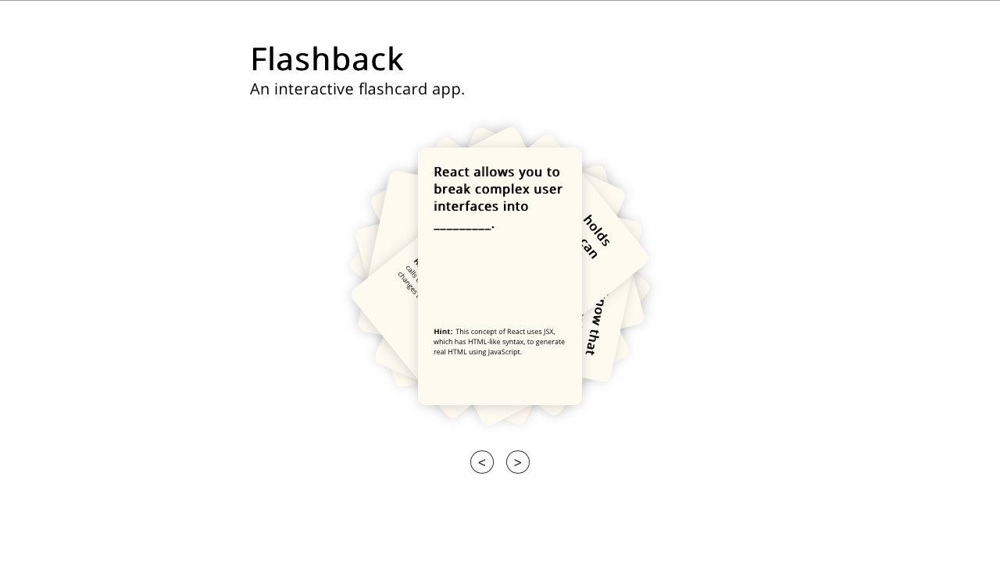

# Flashback

A flashcard app designed using React.js. A single-page app that allows the user to scroll through flashcards and flip them for the answer to questions about React.

## Built With

* React

## Acknowledgments

* [The Firehose Project](https://thefirehoseproject.com)
